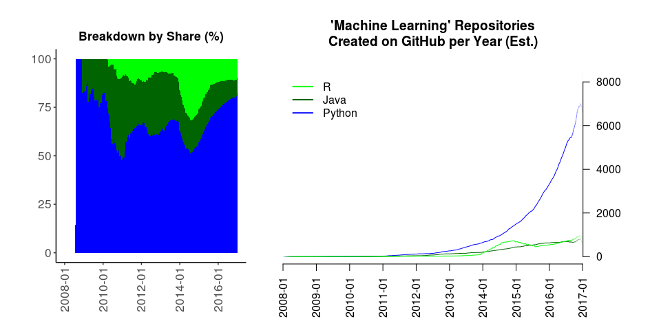
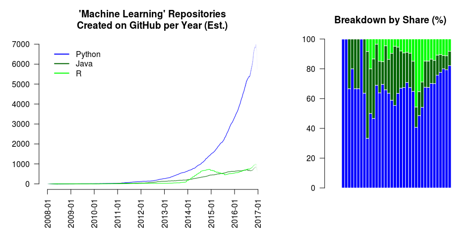
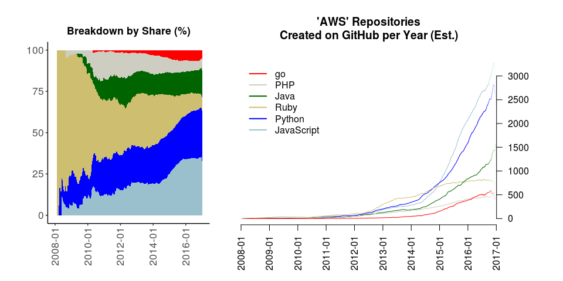
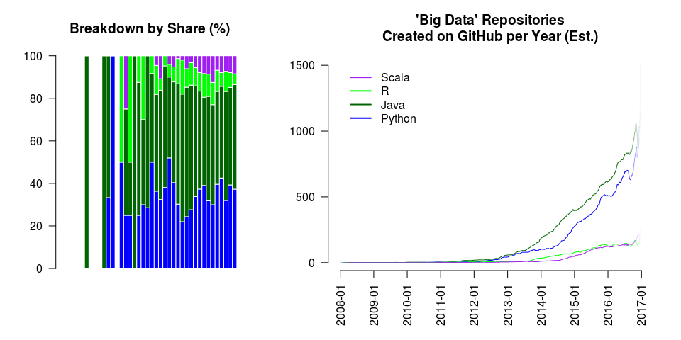
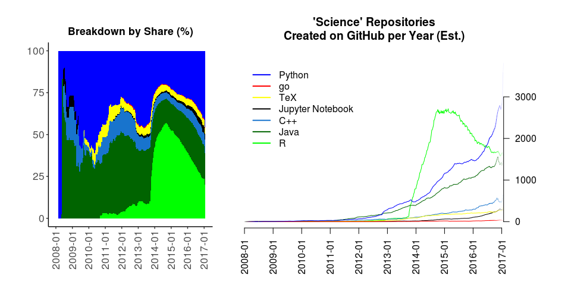
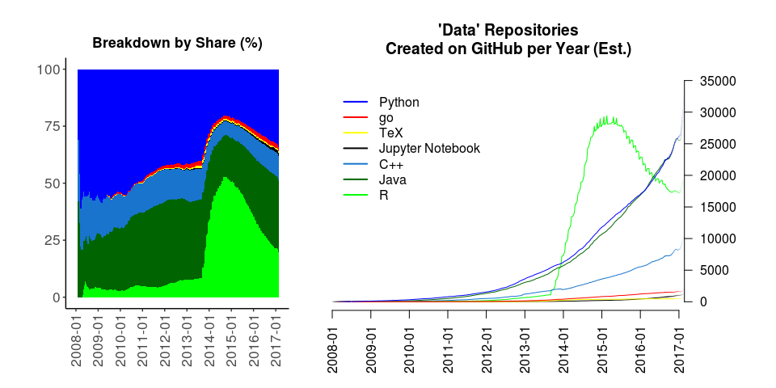
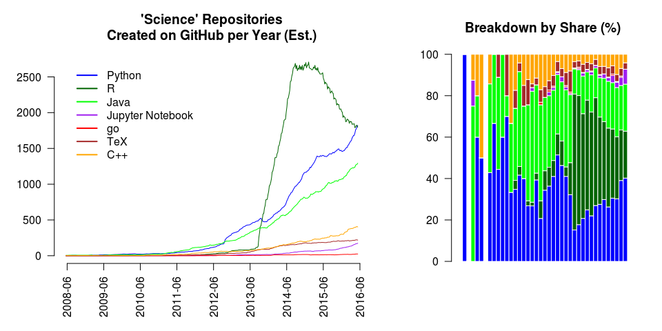
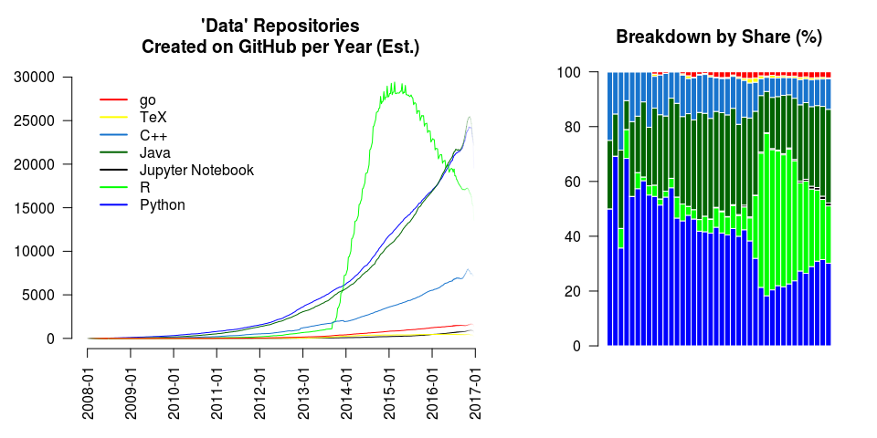
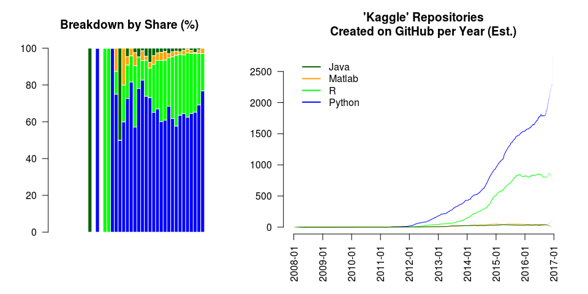
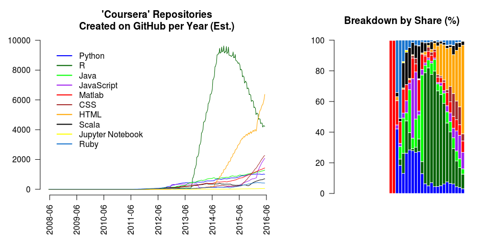

-   [Picking a Language for Analytics and Machine Learning
    (Working Draft)](#picking-a-language-for-analytics-and-machine-learning-working-draft)
    -   [Executive Conjecture](#executive-conjecture)
    -   [Introduction](#introduction)
    -   [Keyword \#1: "Analysis"](#keyword-1-analysis)
    -   [Keyword \#2: "Spark"](#keyword-2-spark)
    -   [Keyword \#3: "Machine Learning"](#keyword-3-machine-learning)
    -   [Keyword \#4: "Deep Learning"](#keyword-4-deep-learning)
    -   [Keyword \#5: "Big Data"](#keyword-5-big-data)
    -   [Keyword \#6: "AWS"](#keyword-6-aws)
    -   [Keyword \#7: "Data Science"](#keyword-7-data-science)
    -   [Keyword \#8: "Science"](#keyword-8-science)
    -   [Keyword \#9: "Data"](#keyword-9-data)
    -   [+1: "Kaggle"](#kaggle)
    -   [+2: "Coursera"](#coursera)
    -   [Future Work](#future-work)
    -   [Conclusion](#conclusion)

Picking a Language for Analytics and Machine Learning (Working Draft)
=====================================================================

*Janos Brezniczky*

*January, 2016*

Executive Conjecture
--------------------

Python.

Introduction
------------

Which language to choose for analytics? It can be hard to tell.

The competition of programming langauges is already a long story and
continues to stretch on. Judging the topic is difficult, subjective and
is prone to statistical methodological issues.

This document is aimed at getting some indication of the trends, but by
no means to come up with a definitive result or judgement over any
debate.

The present version is in an exploratory/draft status, and attempts to
achieve even less - to be a starting point for the above.

To gather the data, a GitHub API client script was used to obtain weekly
statistics, then a moving average was applied to get values smoothed
over 53-week windows to get visually comprehensible charts and
compensate for seasonality effects. The R vs. 'Analysis' numbers clearly
feature an outlier, it is yet to be looked into what event this
corresponds with.

Keyword \#1: "Analysis"
-----------------------

The most interesting here is probably that the influence of R seems to
plateau out.

For some, the likely surprise of the (currently fractional) year 2016
may also be that Python (at least in this aspect) seems to be overtaking
the lead in being the prime vehicle for analytics from R. Beyond that,
both are strong candidates and Python is obviously involved in more
analysis related libraries than R (part of the perceived growth is that
it is probably catching up), which is just one of the reasons to scratch
our heads whether to accept such finding as a fact. However, probably
not many are that surprised, and this is just what it is. The R
ecosystem needs to pull itself together quick if it wants to achieve
more than to see the Python train passing. Python seems to be in the
early adoption/early majority phase, which signifies a prospect for
heavy future growth in this area. (See
[Wikipedia](https://en.wikipedia.org/wiki/Diffusion_of_innovations).)

(Note that GitHub is a distorted representation - a large proportion of
the repositories is simple coursework... but also mind that coursework
is a good predictor of future preference.)

Keyword \#2: "Spark"
--------------------

Scala steadily seems to be the major player at Spark. SparkR is in a
pre-explosion state, if anywhere - and R didn't make it to the top 10 in
any year.

However, looking at ItJobsWatch provides a slightly different result at
the time writing, at least in the London context: Java and Apache Spark
are more often colocated in job advertisements than Scala and Apache
Spark. But! Java is big (30%) otherwise, some Spark users and thus teams
will have a Hadoop background with a carried over Java preference, and
not sure how much of its slight dominance would be left once we
corrected for that.

See <http://www.itjobswatch.co.uk/jobs/london/apache%20spark.do> for the
current status in case of interest.

Similarly GitHub for the past 6 months indicates a trendshift, too -
however due to potential seasonality issues and overwhelming Christmas
laziness that's not been presented here. Next version.

Keyword \#3: "Machine Learning"
-------------------------------

I think this one needs no explanation. In my experience, GitHub repos
are quite often related to online learning, and the conclusion to draw
is that Python is the de facto standard of choice for teaching machine
learning. One remarkable aspect is perhaps that the growth is beautfully
exponential - it is typically an early phase of an adoption curve,
again.

Keyword \#4: "Deep Learning"
----------------------------

Keyword \#5: "Big Data"
-----------------------

Keyword \#6: "AWS"
------------------

Keyword \#7: "Data Science"
---------------------------

Keyword \#8: "Science"
----------------------

Keyword \#9: "Data"
-------------------

+1: "Kaggle"
------------

+2: "Coursera"
--------------

GitHub, the most popular free source source code repository service, is
the vehicle for many assignments on Coursera, which then is the most
popular MOOC, and as such, heavily affects even a massive vehicle like
GitHub. From the above chart it already gets clear that these courses
are at the heart of R's popularity on GitHub, and are accountable for at
least one significant growth period (starting around mid-2013 +- 6
months) in the use of R. This probably was the [Data Science
Specialization](https://www.coursera.org/specializations/jhu-data-science).

However, this impact is not necessarily a bad thing from the perspective
of the analysis - future analysts are trained in the present, and so
does their current preference drive future use.

Future Work
-----------

JavaScript and HTML have notoriously been omitted from these statistics.
These are considered the presentation or output in this analysis and
thus not the 'active ingredient'. While JavaScript is included on the
AWS charts, it is difficult to tell to what extent it was useful to do
so. However, the means of presentation is an important factor of an
analysis, and its merits will be re-evaluated somehow. Another, strongly
related and problematic aspect is that repositories are normally
multi-lingual, thus "intersection sets" will need to be checked on and
accounted for. A similar and more worrying problem is that multi-word
search phrases, like \["Big Data"\] are not actually treated as a single
literal, but probably as \["Big" + "Data"\] (i.e. or'ed), thus giving
distorted results.

Conclusion
----------

Python.

At the minute, it seems, if you only choose one programming language for
analytics (however over-idealistic that situation may be), or about to
choose your first one, it is Python for the win. It appears to be of
significant presence (transferrable) or sheer dominance (hard to
dismiss) in every single aspect examined above. And you won't be alone
with using it. There are lots of things to work out in such an exploding
ecosystem, and in the best case you're part of the happenings.
