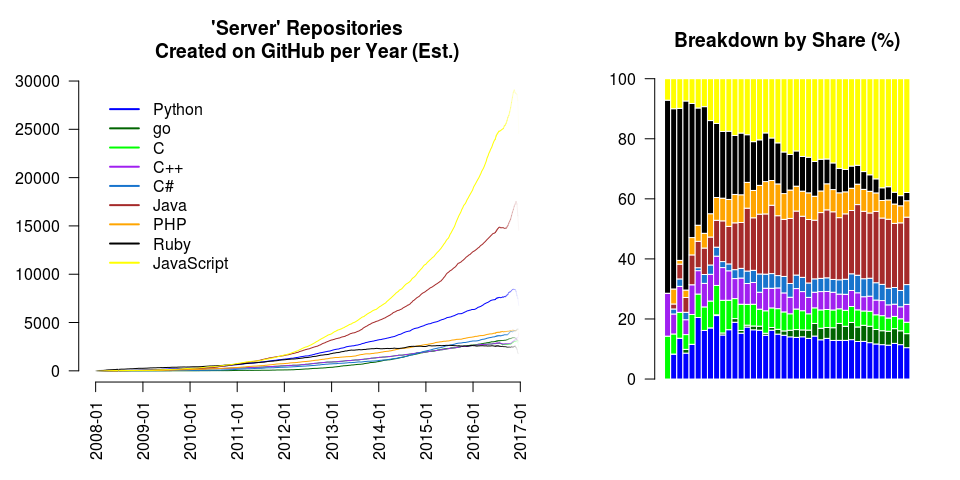
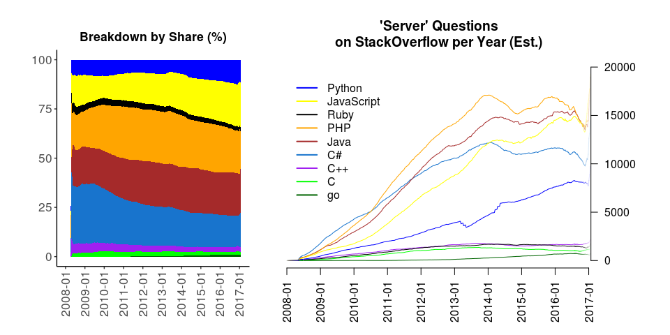
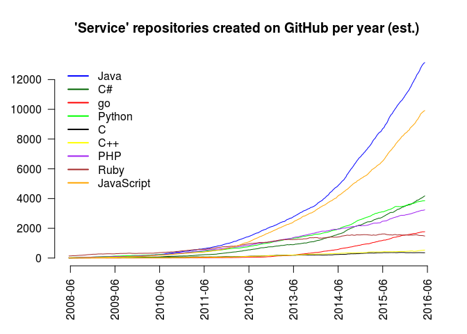
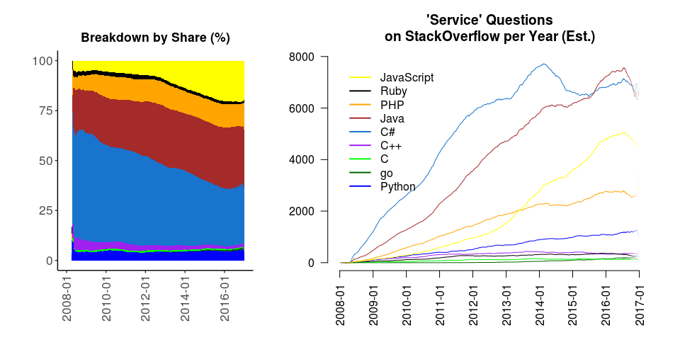
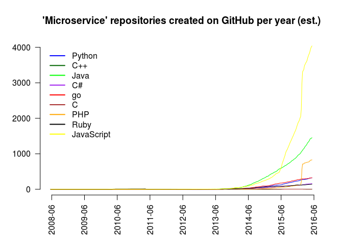
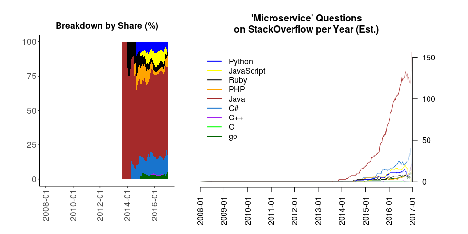

-   [Picking a Language for Server-Side Programming
    (Working Draft)](#picking-a-language-for-server-side-programming-working-draft)
    -   [Introduction](#introduction)
    -   [Methodology](#methodology)
    -   [Keyword \#1: "Server"](#keyword-1-server)
    -   [Keyword \#2: "Web Server"](#keyword-2-web-server)
    -   [Keyword \#3: "Service"](#keyword-3-service)
    -   [Keyword \#4: "Microservice"](#keyword-4-microservice)
    -   [Future Work](#future-work)
    -   [Conclusion](#conclusion)

Picking a Language for Server-Side Programming (Working Draft)
==============================================================

*Janos Brezniczky*

*March, 2017*

Introduction
------------

I don't have much to do with server-side programming these days, so I'll
let the charts speak for themselves, mostly.

The [Wikipedia Diffusion of
innovations](https://en.wikipedia.org/wiki/Diffusion_of_innovations)
article may give some ideas what curve types (or the superposition of
those) we can see on the charts, however it is difficult to decide the
impregnation of which area(s) are described by each curve from merely
these graphs, and to find out which of these, if any, have already
started to reach into the flattening out (late majority) phase.

Methodology
-----------

The document is based on the [GitHub](http://github.com) public
repository and [StackOverflow](http://stackoverflow.com) question
statistics.

The data is weekly statistics, obtained from both sites via their public
API.

A moving average filter is applied next, to get values smoothed over
53-weekwindows to get visually comprehensible charts and compensate for
seasonality effects. Where the data does not allow for the entire
filtering window width, the uncertainity (variance) increases, this is
represented by fainter (more transparent) colors, as seen near the
edges.

Keyword \#1: "Server"
---------------------

Keyword \#2: "Web Server"
-------------------------

Keyword \#3: "Service"
----------------------

Keyword \#4: "Microservice"
---------------------------

Future Work
-----------

A problematic aspect is that repositories are normally multi-lingual,
thus "intersection sets" will need to be checked on and accounted for.
An interesting thing can be the synchronous jump in PHP and JavaScript
around early 2016.

A very fundamental issue is just by these charts it is not possible to
accurately compare the actual popularity of "servers" e.g. in Python vs.
R, as the word "server" just happens to appear in any text at times, and
Python has a much larger user base, hence a higher volume of standard
activity (not closely related to analytics).

Conclusion
----------

No conclusion here for now - choose whatever best fits.
