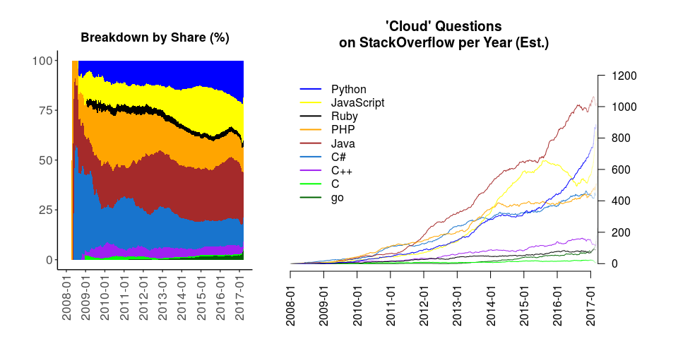

-   [Picking a Language for Server-Side Programming
    (Working Draft)](#picking-a-language-for-server-side-programming-working-draft)
    -   [Introduction](#introduction)
    -   [Methodology](#methodology)
    -   [Keyword \#1: "Server"](#keyword-1-server)
    -   [Keyword \#2: "Cloud"](#keyword-2-cloud)
    -   [Keyword \#3: "Serverless"](#keyword-3-serverless)
    -   [Keyword \#4: "Service"](#keyword-4-service)
    -   [Keyword \#5: "Microservice"](#keyword-5-microservice)
    -   [Keyword \#6: "Web Server"](#keyword-6-web-server)
    -   [Future Work](#future-work)
    -   [Conclusion](#conclusion)

Picking a Language for Server-Side Programming (Working Draft)
==============================================================

*Janos Brezniczky*

*April, 2017*

Introduction
------------

I don't have much to do with server-side programming these days, so I'll
let the charts speak for themselves, mostly.

The [Wikipedia Diffusion of
innovations](https://en.wikipedia.org/wiki/Diffusion_of_innovations)
article may give some ideas what curve types (or the superposition of
those) we can see on the charts, however it is difficult to decide the
impregnation of which area(s) are described by each curve from merely
these graphs, and to find out which of these, if any, have already
started to reach into the flattening out (late majority) phase.

Methodology
-----------

The document is based on the [GitHub](http://github.com) public
repository and [StackOverflow](http://stackoverflow.com) question
statistics.

The data is weekly statistics, obtained from both sites via their public
API.

A moving average filter is applied next, to get values smoothed over
53-week windows to get visually comprehensible charts and compensate for
seasonality effects. Where the data does not allow for the entire
filtering window width, the uncertainity (variance) increases, this is
represented by fainter (more transparent) colors, as seen near the
edges.

Keyword \#1: "Server"
---------------------

Just guesses: What we can see is the interest in server programming
seems to stagnate/decrease on StackOverflow. My guess here is that on
the one hand, various stacks and the adoption of methodologies more
commonplace elsewhere (such as OOP in JavaScript) probably have boosted
productivity. On the other hand, servers themselves are less likely to
be implemented ground up. I'd expect it is also less likely that the
server itself is the product, or is written ground up, rather the
application-specific features. It would be also nice to verify if, for
instance, a few popular servers are becoming the standard. A quick
check: as of 14/04/2017, about half of the SO Python Server questions
are related to Django. A better documentation, questions already
answered can also be related.

Keyword \#2: "Cloud"
--------------------

The interest in cloud-related topics seems to be on the incline.

While the increase in the latter doesn't fully explain the halt in the
server topic growth, cloud can easily overtake the market from classic
server hosting. Classic server languages definitely stopped gaining more
interest - perhaps down to a better documentation, or as elsewhere
mentioned (TODO: add link to prog.hu!), in the favour of newer-style, JS
and Python based approaches.

Keyword \#3: "Serverless"
-------------------------

Serverless is just my favourite candidate for the future. Spinning up a
cluster takes time. Possibly the biggest drawback with cloud computing
is having to wait for the response. If that is reduced, that's already
great - but so is the lower need for operations-related duties. This may
enable people to focus on a smaller set of activities, and perform those
to a higher quality. Whether an abstraction above e.g. AWS Lambda's is
to come, is a further question. These requests are not meant to run
infinitely long - but they are said to scale well. Operations in the
cloud anyway are typically somewhat fragmented so that finishing an
interrupted operation becomes more effortless.

Keyword \#4: "Service"
----------------------

Keyword \#5: "Microservice"
---------------------------

Keyword \#6: "Web Server"
-------------------------

Future Work
-----------

A problematic aspect is that repositories are normally multi-lingual,
thus "intersection sets" will need to be checked on and accounted for.
An interesting thing can be the synchronous jump in PHP and JavaScript
around early 2016.

A very fundamental issue is just by these charts it is not possible to
accurately compare the actual popularity of "servers" e.g. in Python vs.
R, as the word "server" just happens to appear in any text at times, and
Python has a much larger user base, hence a higher volume of standard
activity (not closely related to analytics).

Conclusion
----------

No conclusion here for now - choose whatever best fits.
